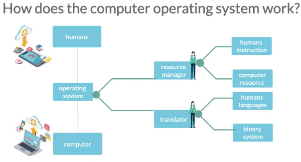
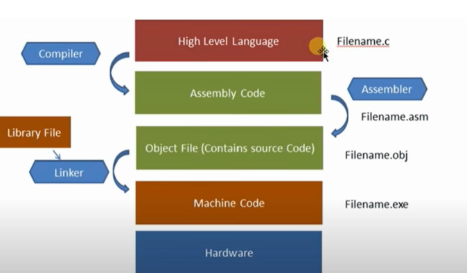
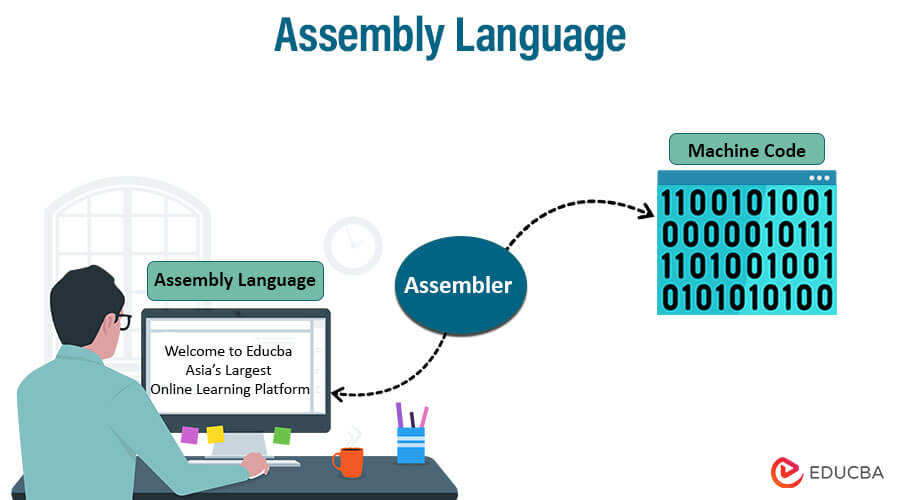

# Well come to Python Fundamental Class 1 
# INTRODUCTION TO PYTHON PROGRAMMING LANGUAGE 

### Befoer learning programming language, we should know what is programming language? 
- Programming language is a set of instructions, commands, and other syntax use to create a software program.
- It is a set of rules that provides a way of telling a computer what operations to perform.
- Programming languages can be used to create programs that implement specific algorithms or to sovle problems .

## How programming language works and interact with computer hardware component ?

- Programming language is a set of instructions, commands, and other syntax use to create a software program.
- It is a set of rules that provides a way of telling a computer what operations to perform.
- A humman interact with computer using programming 
- Programming languages can be used to create programs that implement specific algorithms or to sovle problems .
- steps of working humman with computer using programming language:
-  first we need operating system to interact with computer hardware component.
-  like this image
-  

-  
-  and operating system also wrriten in programming language.
-  then we need a  compiler or interpreter to convert our programming language to machine language.
-  and complier or interpreter also wrriten in programming language.
   
   - see this image

## Main types of programming language
- There are two main types of programming language
- 1. High level programming language
- 2. Low level programming language

### High level programming language
- High level programming language are nearly human readable language.
- Examples : Python, Java, C++, C#, PHP, Ruby, Swift, Objective-C, Visual Basic, JavaScript, Perl, Python, R, MATLAB, and SQL.
- it is easy to understand and write.(like english language)

### Low level programming language
- Low level programming language are nearly machine language.
- Examples : Assembly language, Machine language(0 and 1), 
- it is hard to understand and write.(like binary language)
liek this image

# Each language has its own syntax and semantics and its own compiler or interpreter.
- Syntax is the set of rules that defines the combinations of symbols that are considered to be correctly structured programs in that language.
- Semantics is the meaning of the symbols and combinations of symbols that are considered to be correctly structured programs in that language.
- Compiler is a program that translates the code written in a high-level programming language to a low-level programming language.
- Interpreter is a program that translates the code written in a high-level programming language to a low-level programming language line by line.

