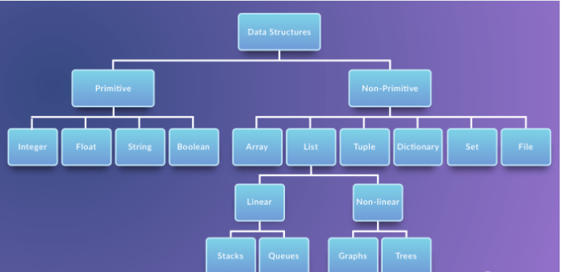
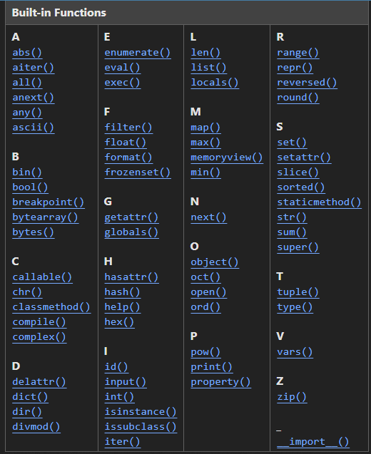

# Well Come to Python Fundamental Class 3
# Class 3 Agenda
- print() function
- Variables
- Data Types

# print() function
- print() function is used to print the output to the console.
  - it is indented by 4 spaces.
  - it is a built-in function in python.
  - it has a default value of None.
  - it is independent function or method.
- Syntax:
  - print(value, ..., sep=' ', end='\n', file=sys.stdout, flush=False)
  - value: any value, it can be a string, integer, float, list, tuple, dictionary, etc.
  - sep: separator, it is used to separate the values, default is space. 
  - end: end, it is used to end the line, default is new line. 
  - file: file, it is used to write the output to the file.
  - flush: flush, it is used to flush the output buffer.
  - return: it returns None.
  - it is a function, so it can be called by using parenthesis. 
  - it can take multiple values separated by comma. 

# Variables
- Variables are containers to store the data. 
- python is a dynamically typed language, so we don't need to specify the data type of the variable.
- Syntax:
  - variable_name = value
  - variable_name: any name, it can be any name, but it should be meaningful.
  - value: any value, it can be a string, integer, float, list, tuple, dictionary, etc.
  - =: assignment operator, it is used to assign the value to the variable. 
  - right side value is assigned to the left side variable name 
  - it is a statement, so it can't be called by using parenthesis or any other way.

# Data Types
- Data types are used to store the data.  
- There are many data types in python, some of them are: 
  - And we device the data types into two categories:
###    - Primitive Data Types
    - Primitive Data Types is used to store the single value. 
###    - Non-Primitive Data Types
    - Non-Primitive Data Types is used to store the multiple values.   

#    Futher we devide these data types into five categories:
###    - Numeric Data Types
    - Numeric Data Types is used to store the numeric values.
###    - Boolean Data Types
    - Boolean Data Types is used to store the True or False values.
###    - Sequence Data Types
    - Sequence Data Types is used to store the sequence of values.
###    - Set Data Types
    - Set Data Types is used to store the unique values.
###    - Mapping Data Types
    - Mapping Data Types is used to store the key-value pairs.

#    - Numeric Data Types
    - Numeric Data Types is used to store the numeric values.
    - There are three numeric data types in python:
      - int: integer, it is used to store the integer values.
      - float: float, it is used to store the float values.
      - complex: complex, it is used to store the complex values.
    - Syntax:
      - int_value = 10
      - float_value = 10.5
      - complex_value = 10 + 5j
    - int: integer, it can be positive or negative.
    - float: float, it can be positive or negative.
    - complex: complex, it can be positive or negative.

#    - Boolean Data Types
    - Boolean Data Types is used to store the True or False values.
    - There are two boolean data types in python:
      - bool: boolean, it is used to store the True or False values.
    - Syntax:
      - bool_value = True
      - bool_value = False
    - bool: boolean, it can be True or False.
#   - Sequence Data Types
    - Sequence Data Types is used to store the sequence of values.
    - There are four sequence data types in python:
      - str: string, it is used to store the string values.
      - list: list, it is used to store the list of values.
      - tuple: tuple, it is used to store the tuple of values.
      - range: range, it is used to store the range of values.
    - Syntax:
      - str_value = 'Hello'
      - list_value = [10, 20, 30]
      - tuple_value = (10, 20, 30)
      - range_value = range(10)
    - str: string, it is used to store the string values.
    - list: list, it is used to store the list of values.
    - tuple: tuple, it is used to store the tuple of values.
    - range: range, it is used to store the range of values.

#    - Set Data Types
    - Set Data Types is used to store the unique values.
    - There is one set data type in python:
      - set: set, it is used to store the unique values.
    - Syntax:
      - set_value = {10, 20, 30}
    - set: set, it is used to store the unique values.

#    - Mapping Data Types
    - Mapping Data Types is used to store the key-value pairs.
    - There is one mapping data type in python:
      - dict: dictionary, it is used to store the key-value pairs.
    - Syntax:
      - dict_value = {'name': 'John', 'age': 25}
    - dict: dictionary, it is used to store the key-value pairs.

#    - None Data Types
    - None Data Types is used to store the None value.
    - There is one None data type in python:
      - None: None, it is used to store the None value.
    - Syntax:
      - none_value = None
    - None: None, it is used to store the None value.

#    - Bytes Data Types
    - Bytes Data Types is used to store the bytes values.
    - There are two bytes data types in python:
      - bytes: bytes, it is used to store the bytes values.
      - bytearray: bytearray, it is used to store the mutable bytes values.
    - Syntax:
      - bytes_value = b'Hello'
      - bytearray_value = bytearray(b'Hello')
    - bytes: bytes, it is used to store the bytes values.
    - bytearray: bytearray, it is used to store the mutable bytes values.

#    - Collection Data Types
    - Collection Data Types is used to store the collection of values.
    - There are three collection data types in python:
      - list: list, it is used to store the list of values.
      - tuple: tuple, it is used to store the tuple of values.
      - set: set, it is used to store the unique values.
    - Syntax:
      - list_value = [10, 20, 30]
      - tuple_value = (10, 20, 30)
      - set_value = {10, 20, 30}
    - list: list, it is used to store the list of values.
    - tuple: tuple, it is used to store the tuple of values.
    - set: set, it is used to store the unique values.

#   These five categories are further divided into two categories:
###    - Mutable Data Types
    - Mutable Data Types is used to change the values. 
    - Mutable Data Types can be changed after creation and it is not hashable(immutable) and it is not ordered.
    - Mutable Data Types can be changed by using the methods.
    - Mutable Data Types can be changed by using the index.
    - Mutable Data Types can be changed by using the slicing.
    - Mutable Data Types can be changed by using the concatenation.

###    - Immutable Data Types
    - Immutable Data Types is used to store the fixed values. 
    - Immutable Data Types can't be changed after creation and it is hashable(immutable) and it is ordered.
    - Immutable Data Types can't be changed by using the methods.
    - Immutable Data Types can't be changed by using the index.
    - Immutable Data Types can't be changed by using the slicing.
    - Immutable Data Types can't be changed by using the concatenation.
    - Immutable Data Types can't be changed by using the assignment operator.

#    - Mutable Data Types
    - list, set, dict, bytearray
#    - Immutable Data Types
    - int, float, complex, bool, str, tuple, range, frozenset, bytes

#   Pythons have some builtin functions 

# Class 3 Assignment
- Create a variable of each data type.
- Print the value of each variable.
- Print the type of each variable.
- Print the id of each variable.
- Print the value of each variable by using the print() function.
- Print the type of each variable by using the print() function.
- Print the id of each variable by using the print() function.
- Print the value of each variable by using the f-string.
- Print the type of each variable by using the f-string.
- Print the id of each variable by using the f-string.
- Print the value of each variable by using the format() function.
- Print the type of each variable by using the format() function.
- Print the id of each variable by using the format() function.
- Print the value of each variable by using the % operator.
- Print the type of each variable by using the % operator.
- Print the id of each variable by using the % operator.
- Print the value of each variable by using the sep and end parameters of the print() function.
- Print the type of each variable by using the sep and end parameters of the print() function.
- Print the id of each variable by using the sep and end parameters of the print() function.
- Print the value of each variable by using the file parameter of the print() function.
